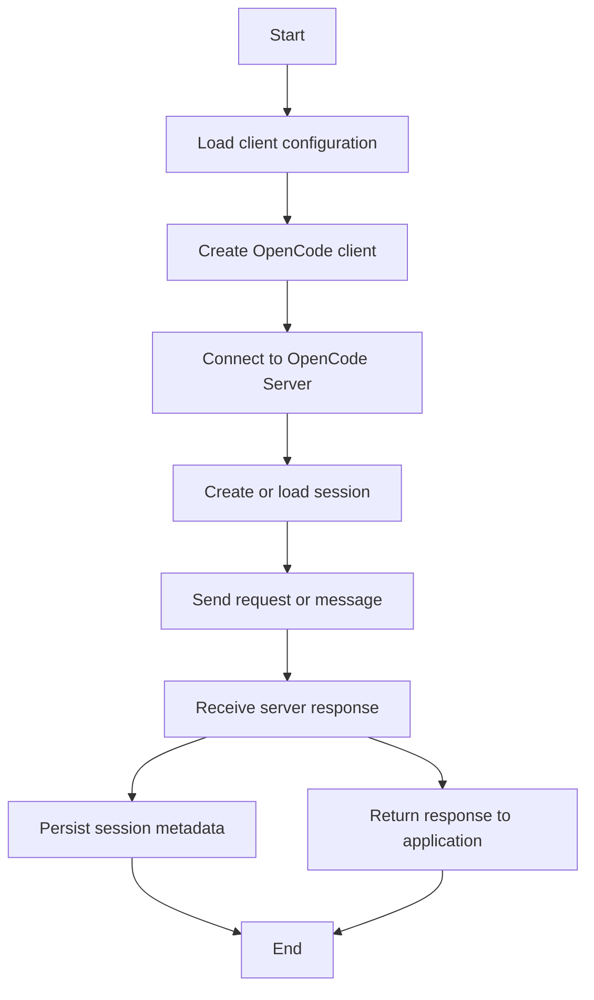

# OpenCode Java Client


🚀 A developer-friendly Java 17 client for the [OpenCode Server](https://github.com/anescobar/opencode-server) HTTP API.

This library helps Java teams integrate OpenCode capabilities into Spring Boot services, backend tools, automation flows, and standalone JVM applications. It provides both a low-level API client for full server coverage and a high-level chat client for conversational workflows with session persistence.

---

## 🗺 Icon Legend
This section lists the icons used throughout this README and what they mean. If icons don't render in your viewer, refer to the ASCII fallback below.

### Legend
- 🚀 Getting started
- ✨ Highlights
- ⚙️ Config
- 🔌 Integrations
- 💾 Persistence
- 🧪 Testing
- 📦 Spring Boot
- 🧭 Diagrams
- 🏛 Architecture
- 🔗 Link / API surface

### ASCII fallback
Icon Legend:
- ROCKET -> 🚀
- SPARKLES -> ✨
- GEAR -> ⚙️
- PLUG -> 🔌
- DISK -> 💾
- TEST -> 🧪
- PACKAGE -> 📦
- DIAGRAM -> 🧭
- ARCH -> 🏛
- LINK -> 🔗

## ✨ Why This Client Exists

The OpenCode Java Client is designed for developers who want to:

- 🔌 connect Java applications to an OpenCode Server instance quickly
- ⚙️ call the full HTTP API from typed Java code
- 💬 build chat-style experiences on top of OpenCode sessions
- 💾 persist and resume conversations across executions
- 🧪 test integrations locally with Docker and automatically with Testcontainers
- 📦 drop the client into Spring Boot with minimal wiring

It exposes two complementary layers:

- `OpenCodeClient` - a low-level blocking client with 50+ methods covering the server API
- `ChatClient` / `ChatClientFactory` - a high-level conversational layer with session lifecycle management, sync and async messaging, and disk persistence

---

## 👀 At A Glance

- ✅ Java 17+
- ✅ Spring Boot 3.5.11+
- ✅ Full OpenCode Server HTTP API coverage
- ✅ High-level chat abstraction
- ✅ Sync and async message flows
- ✅ Session persistence via `session.json`
- ✅ Docker-friendly local development
- ✅ Testcontainers-based integration testing

---

## 🏛️ Architecture

```text
Application code
      |
      v
ChatClientFactory        manages client identity, disk persistence, and cache
      |
      v
ChatClient               scoped to one session; send / sendAsync / listMessages
      |
      v
OpenCodeClientOperations Java interface with 50+ methods
      |
      v
OpenCodeClient           WebClient-based HTTP implementation
      |
      v
OpenCode Server          remote or local HTTP service (default local port 4096)
```

---

## 🚀 Functional Introduction

The client supports two common integration styles:

### ⚙️ Direct API integration

Use `OpenCodeClient` when you want explicit control over requests such as:

- session creation and management
- message sending
- file inspection
- project discovery
- configuration updates
- agent and command listing
- TUI-related actions exposed by the server

### 💬 Conversational integration

Use `ChatClient` when your application needs a higher-level workflow:

- convert plain text into OpenCode message parts automatically
- persist session metadata between runs
- resume prior conversations using a stable client ID
- send messages synchronously or asynchronously
- hide repetitive session plumbing from application code

---

## 🔌 OpenCode Server Integration Features

This library is built specifically to integrate cleanly with OpenCode Server.

### 🔗 Connection and transport

- Configure the server endpoint with `opencode.client.base-url`
- Connect to local, containerized, or remote OpenCode Server instances
- Use configurable connect and response timeouts
- Add optional retry behavior for transient failures

### 🔒 Authentication support

- HTTP Basic Auth is supported through `username` and `password`
- Credentials remain optional and are only needed when the server requires them

### 🌱 Spring Boot integration

- Auto-configures `OpenCodeClientOperations`
- Auto-configures `ChatClientFactory`
- Activates when `opencode.client.base-url` is present
- Fits naturally into standard dependency injection patterns

### 💾 Session continuity

- Persist chat session metadata to disk
- Reopen the same OpenCode session across multiple app runs
- Keep stable client identities for bots, assistants, and workflows

### 🐳 Local developer workflows

- Start the server with Docker or `docker-compose`
- Run integration tests using the real OpenCode Server image
- Validate real request/response behavior before production integration

### 🧪 Integration testing

- `mvn test` for unit tests without Docker
- `mvn verify` for unit plus integration tests with Testcontainers
- Verify server compatibility from Java code end to end

---

## 📝 Requirements

| Dependency | Version |
|------------|---------|
| Java | 17+ |
| Spring Boot | 3.5.11+ |
| Maven | 3.8+ |
| Docker | 20+ (integration tests only) |

---

## 📦 Installation

Add the dependency to your `pom.xml`:

```xml
<dependency>
    <groupId>com.opencode</groupId>
    <artifactId>opencode-java-client</artifactId>
    <version>1.0.0</version>
</dependency>
```

---

## ⚡ Quick Start

### 🌱 Spring Boot (recommended)

1. Add the dependency.
2. Configure the base URL in `application.yml`.
3. Inject the generated beans.

```yaml
opencode:
  client:
    base-url: http://localhost:4096
```

```java
@Autowired
private OpenCodeClientOperations client;

@Autowired
private ChatClientFactory chatFactory;
```

When `opencode.client.base-url` is set, Spring Boot auto-configuration creates both beans automatically.

### ☕ Standalone Java

```java
OpenCodeClientProperties props = new OpenCodeClientProperties();
props.setBaseUrl("http://localhost:4096");
props.setConnectTimeout(Duration.ofSeconds(5));
props.setResponseTimeout(Duration.ofSeconds(60));

WebClient webClient = WebClient.builder()
    .baseUrl(props.getBaseUrl())
    .build();

OpenCodeClientOperations api = new OpenCodeClient(webClient, props);
ChatClientFactory factory = new ChatClientFactory(api);
```

---

## 🧭 Developer Flow

If you are new to the project, this is the shortest path to productivity:

1. 🐳 Start OpenCode Server locally
2. 📦 Add the Maven dependency
3. ⚙️ Configure `opencode.client.base-url`
4. 🚀 Inject `OpenCodeClientOperations` or `ChatClientFactory`
5. 💬 Create a session and send a message
6. 🧪 Run `mvn verify` to validate the integration

---

## 📊 Activity Diagram

### 🖨️ ASCII diagram

```text
Start
  |
  v
Load client configuration
  |
  v
Create OpenCode client
  |
  v
Connect to OpenCode Server
  |
  v
Create or load session
  |
  v
Send request or message
  |
  v
Receive server response
  |
  +------------------------+
  |                        |
  v                        v
Persist session       Return response
  |                        |
  +-----------+------------+
              |
              v
             End
```

### 🧭 Mermaid diagram



---

## ⚙️ Configuration Reference

All configuration properties are under the `opencode.client.*` prefix.

| Property | Type | Default | Description |
|----------|------|---------|-------------|
| `base-url` | `String` | - | Required. Base URL of the OpenCode Server |
| `username` | `String` | `null` | HTTP Basic Auth username |
| `password` | `String` | `null` | HTTP Basic Auth password |
| `connect-timeout` | `Duration` | `5s` | TCP connection timeout |
| `response-timeout` | `Duration` | `60s` | Read timeout per HTTP response |
| `max-retries` | `int` | `0` | Automatic retries for transient failures |

Full example:

```yaml
opencode:
  client:
    base-url: http://localhost:4096
    username: admin
    password: secret
    connect-timeout: 5s
    response-timeout: 120s
    max-retries: 2
```

---

## 🛠️ Running OpenCode Server Locally

### 🐳 Docker

```bash
docker run -p 4096:4096 anescobar/opencode-server:1.0.0
```

### 📦 Docker Compose

```bash
docker-compose -f docker/docker-compose.yaml up -d
```

This starts `anescobar/opencode-server:1.0.0` on port `4096`.

---

## 🛰️ Low-Level API Usage (`OpenCodeClient`)

Use `OpenCodeClient` when you want direct access to the server API.

### 💚 Health

```java
HealthResponse health = client.getHealth();
System.out.println(health.isHealthy());
System.out.println(health.getVersion());
```

### 📂 Projects

```java
List<Project> all = client.listProjects();
Project current = client.getCurrentProject();
```

### 📇 Sessions

```java
Session session = client.createSession(
    CreateSessionRequest.builder().title("My session").build());

String sessionId = session.getId();

Session fetched = client.getSession(sessionId);
List<Session> all = client.listSessions();
List<Session> children = client.getSessionChildren(sessionId);
Map<String, SessionStatus> statuses = client.getSessionStatuses();

Session updated = client.updateSession(
    sessionId,
    UpdateSessionRequest.builder().title("New title").build());

Session forked = client.forkSession(sessionId);
Session shared = client.shareSession(sessionId);
Session unshared = client.unshareSession(sessionId);
client.abortSession(sessionId);
Boolean deleted = client.deleteSession(sessionId);
```

### 📨 Messages

```java
List<MessageWithParts> messages = client.listMessages(sessionId);
MessageWithParts message = client.getMessage(sessionId, messageId);

MessageWithParts reply = client.sendMessage(
    sessionId,
    SendMessageRequest.builder()
        .parts(List.of(Part.builder().type("text").text("Hello!").build()))
        .build());

client.sendMessageAsync(sessionId, request);

MessageWithParts commandResult = client.executeCommand(
    sessionId,
    ExecuteCommandRequest.builder().command("init").build());

MessageWithParts shellResult = client.shellCommand(
    sessionId,
    ShellRequest.builder().command("ls -la").build());
```

### 📁 Files

```java
List<FileNode> nodes = client.listFiles("/src");
FileContent content = client.getFileContent("/src/Main.java");
List<?> status = client.getFileStatus();
List<String> found = client.findFiles("Main");
List<?> matches = client.findInFiles("TODO");
List<?> symbols = client.findSymbols("MyService");
```

### 🧰 Config, Providers, Agents, Commands

```java
AppConfig config = client.getConfig();
client.updateConfig(config);
Map<?, ?> providers = client.getConfigProviders();

List<Agent> agents = client.listAgents();
List<Command> commands = client.listCommands();
List<Provider> providerList = client.listProviders();
```

### 📝 Logging

```java
client.log(LogRequest.builder()
    .service("my-service")
    .level("info")
    .message("Something happened")
    .extra(Map.of("requestId", "abc123"))
    .build());
```

### 🔌 LSP, formatters, MCP

```java
List<LspStatus> lsp = client.getLspStatus();
List<FormatterStatus> formatters = client.getFormatterStatus();
Map<?, ?> mcp = client.getMcpStatus();
client.addMcpServer(new McpAddRequest());
```

### 🖥️ TUI control

```java
client.tuiAppendPrompt(new TuiAppendPromptRequest());
client.tuiSubmitPrompt();
client.tuiClearPrompt();
client.tuiShowToast(new TuiShowToastRequest());
client.tuiExecuteCommand(new TuiExecuteCommandRequest());
client.tuiOpenHelp();
client.tuiOpenSessions();
client.tuiOpenThemes();
client.tuiOpenModels();
```

---

## 💬 High-Level API Usage (`ChatClient`)

Use `ChatClient` when you want a more natural conversational abstraction.

The `ChatClient` manages one OpenCode session and handles:

- plain text to `Part(type="text")` conversion
- session persistence to disk
- async polling with callback delivery

### 🚀 Basic conversation

```java
ChatClientFactory factory = new ChatClientFactory(api);

try (ChatClient chat = factory.newClient()) {
    MessageWithParts reply = chat.send("Explain dependency injection in one sentence.");
    System.out.println(reply.getParts().get(0).getText());

    List<MessageWithParts> history = chat.listMessages();
}
```

### 🔁 Resume a previous session

```java
String clientId = "my-bot-session";

ChatClient chat = factory.newClient(clientId);
chat.send("Hello!");
chat.close();

ChatClient resumed = factory.getClient(clientId);
resumed.send("Continuing our conversation...");
resumed.close();
```

### ⏳ Async messaging

```java
chat.sendAsync("Generate a Java hello-world program.", reply -> {
    reply.getParts().forEach(p -> System.out.println(p.getText()));
});
```

### 🔎 Discover persisted sessions

```java
String[] ids = factory.listClientIds();
```

### 🌱 Spring service integration

```java
@Service
public class MyService {

    private final ChatClientFactory factory;

    public MyService(ChatClientFactory factory) {
        this.factory = factory;
    }

    public String ask(String question) {
        try (ChatClient chat = factory.newClient()) {
            return chat.send(question)
                .getParts().get(0).getText();
        }
    }
}
```

---

## 💾 Session Persistence

`ChatClientFactory` stores session metadata as JSON files:

```text
<sessionsRoot>/
└── <clientId>/
    └── session.json
```

Default `sessionsRoot`:

- Maven or IDE run: `src/main/resources/sessions/`
- JAR deployment: `sessions/` directory next to the JAR

Override at construction time:

```java
ChatClientFactory factory = new ChatClientFactory(api, Path.of("/var/data/sessions"));
```

Example `session.json`:

```json
{
  "clientId": "a3f1e2b0-7c4d-4e5f-9a1b-0c2d3e4f5a6b",
  "sessionId": "ses_336760ad5ffeINuBEBG5n3vlec",
  "title": "chat-a3f1e2b0-7c4d-4e5f-9a1b-0c2d3e4f5a6b",
  "createdAt": "2026-03-08T10:00:00Z",
  "lastActivityAt": "2026-03-08T10:15:32Z"
}
```

---

## ⚠️ Error Handling

| Exception | When thrown |
|-----------|-------------|
| `OpenCodeClientHttpException` | HTTP 4xx or 5xx response from the server |
| `OpenCodeClientException` | Timeout, connection refused, or other network error |
| `IllegalArgumentException` | Blank `text` or `clientId` passed to the client layer |
| `UncheckedIOException` | Failure reading or writing `session.json` |

```java
try {
    MessageWithParts reply = chat.send("Hello!");
} catch (OpenCodeClientHttpException e) {
    System.out.println(e.getStatusCode());
    System.out.println(e.getMessage());
} catch (OpenCodeClientException e) {
    // Timeout or network failure
} catch (IllegalArgumentException e) {
    // Blank input
}
```

---

## 🧪 Building and Testing

```bash
# Unit tests only (WireMock, no Docker required)
mvn test

# Unit + integration tests (requires Docker daemon)
mvn verify

# Build and install to local Maven cache
mvn clean install -Dmaven.javadoc.skip=true
```

### 📋 Test suite summary

| Suite | Type | Framework | Tests |
|-------|------|-----------|-------|
| `OpenCodeClientTest` | Unit | JUnit 5 + WireMock | 68 |
| `ChatClientFactoryTest` | Unit | JUnit 5 + Mockito | 18 |
| `OpenCodeClientIT` | Integration | JUnit 5 + Testcontainers | 42 |
| `ConversationalMessagingIT` | Integration | JUnit 5 + Testcontainers | 13 |
| **Total** |  |  | **141** |

Integration tests automatically spin up the OpenCode Server image with Testcontainers, so the Java client is exercised against a real server instance.

---

## 📚 API Specifications

OpenAPI 3.1.0 specs are available under `specs/`:

| File | Description |
|------|-------------|
| `specs/opencode-server-api.yaml` | Full HTTP contract of the OpenCode Server |
| `specs/chat-client-api.yaml` | Conceptual REST-like model of the Java chat API surface |

---

## 📂 Project Structure

```text
├── pom.xml
├── docker/
│   └── docker-compose.yaml
├── specs/
│   ├── opencode-server-api.yaml
│   └── chat-client-api.yaml
└── src/
    ├── main/
    │   ├── java/com/opencode/client/
    │   │   ├── OpenCodeClientOperations.java
    │   │   ├── OpenCodeClient.java
    │   │   ├── chat/
    │   │   │   ├── ChatSession.java
    │   │   │   ├── ChatClient.java
    │   │   │   └── ChatClientFactory.java
    │   │   ├── config/
    │   │   │   ├── OpenCodeClientAutoConfiguration.java
    │   │   │   └── OpenCodeClientProperties.java
    │   │   ├── model/
    │   │   └── exception/
    │   └── resources/
    │       ├── META-INF/spring/
    │       └── sessions/
    └── test/
        └── java/com/opencode/client/
            ├── unit/
            └── integration/
```

---

## ℹ️ Known Behavior Notes

- `POST /session` - omit `parentID` when creating a root session
- `POST /log` - `level` must be lowercase and `extra` must be omitted or non-null
- `POST /session/{id}/fork` - must be called with no request body
- DTOs use `@JsonInclude(NON_NULL)`, so null fields are not serialized
- Lombok-related IDE warnings may appear even though `mvn` compiles successfully

---

## 🤝 Developer-Friendly Summary

If your team needs a clean Java integration for OpenCode Server, this client gives you:

- 🏗️ Spring Boot-native wiring
- 🛰️ low-level access to the full server API
- 💬 high-level conversational workflows
- 💾 persistent chat sessions across runs
- 🐳 local Docker-based integration
- 🧪 strong automated verification with Testcontainers

It is meant to be easy to adopt, easy to test, and easy to explain to other developers on your team.
